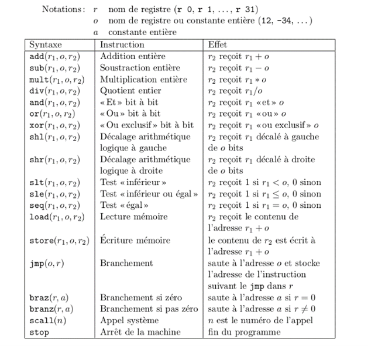
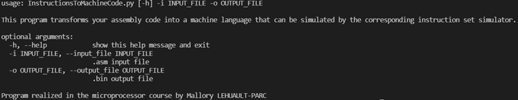
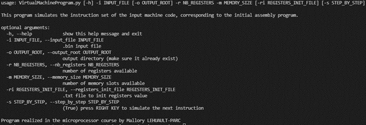

> [Mallory Lehuault-Parc](https://github.com/MalloryLP)

## Introduction

Instsim est un simulateur de jeu d'instruction minimaliste. Développez votre programme en assembleur et simulez le grace à Instsim.

## De l'assembleur vers le code machine

L’intérêt de ce premier programme est de convertir un programme en assembleur en une suite d’instructions interprétables par une machine virtuelle. Les instructions concernées sont les suivantes :

<p align="center" width="100%">
      
</p>

Le programme InstructionToMachineCode.py peut être lancé sur Linux, Windows et MacOS. Pour fonctionner, le programme prend en entré un jeu d’instruction assembleur (.asm) et fourni en sortie le jeu d’instruction en code machine (.bin).

La traduction doit être lancé de la manière suivante : 

```shell
python InstructionToMachineCode.py -i asm_file.asm -o output_file.bin
```

Avec :
- -i asm_file.asm, le fichier assembleur contenant un programme à traduire
- -o output_file.bin, le fichier binaire où sont les instructions traduites en langage machine

Si vous ne parvenez pas à lancer le programme, plus d’informations sont disponible avec la commande suivante :

```shell
python InstructionToMachineCode.py -h
```

<p align="center" width="100%">
      
</p>

## Simulation du programme généré

La simulation du programme assembleur précédemment traduit se fait au travers du programme python VirtualMachineProgram.py.

Le programme VirtualMachineProgram.py peut être lancé sur Linux, Windows et MacOS. Pour fonctionner, le programme prend en entré au minimum un jeu d’instruction de code machine (.bin), le nombre de registres et le nombre de cases mémoire nécessaires pour faire fonctionner le programme à simuler. Le programme rend en sortie de simulation un bilan de la simulation dans un fichier (.txt) horodaté.

Le programme doit être lancé de la manière suivante :

```shell
python VirtualMachineProgram.py -i machinecode.bin -r 32 -m 64
```

Avec :
- -i machinecode.bin, le programme en langage machine
- -r 32, le nombre de registre utilisés (ici, 32) sur 32 bits signés initialisés à 0
- -m 64, le nombre de slots mémoire (ici, 64) sur 32 bits signés initialisés à 0

Si vous ne parvenez pas à lancer le programme, plus d’informations sont disponible avec la commande suivante :

```shell
python VirtualMachineProgram.py -h
```

<p align="center" width="100%">
      
</p>

VirtualMachineProgram.py propose plusieurs options de lancement en plus des options obligatoires. On y retrouve :
- -i OUTPUT_ROOT : renseigner un répertoire où les fichiers bilan (.txt) doivent être enregistrés (utile lors d’une série de test).
- -ri REGISTERS_INIT_FILE : renseigner un fichier (.txt) pour initialiser les registres utilisés lors de la simulation.
- -s STEP_BY_STEP : renseigner cette option avec la valeur « True » signifie que vous pouvez simuler instructions par instructions votre programme en appuyant sur la flèche droite directionnelle.

Exemple de lancement :

```shell
python VirtualMachineProgram.py -i machinecode.bin -ri regs.txt -o logs -r 32 -m 64 -s True
```

Avec :
- -i machinecode.bin, le fichier binaire correspondant au programme à simuler
- -ri regs.txt, le fichier texte pour initialiser les registres avec une certaine valeur au démarrage
- -o logs, le répertoire où sera enregistré le fichier bilan de la simulation
- -r 32, le nombre de registre utilisés sur 32 bits signés
- -m 64, le nombre de slots mémoire sur 32 bits signés
- -s True, il faudra appuyer sur la flèche de droite pour passer à l’instruction suivante